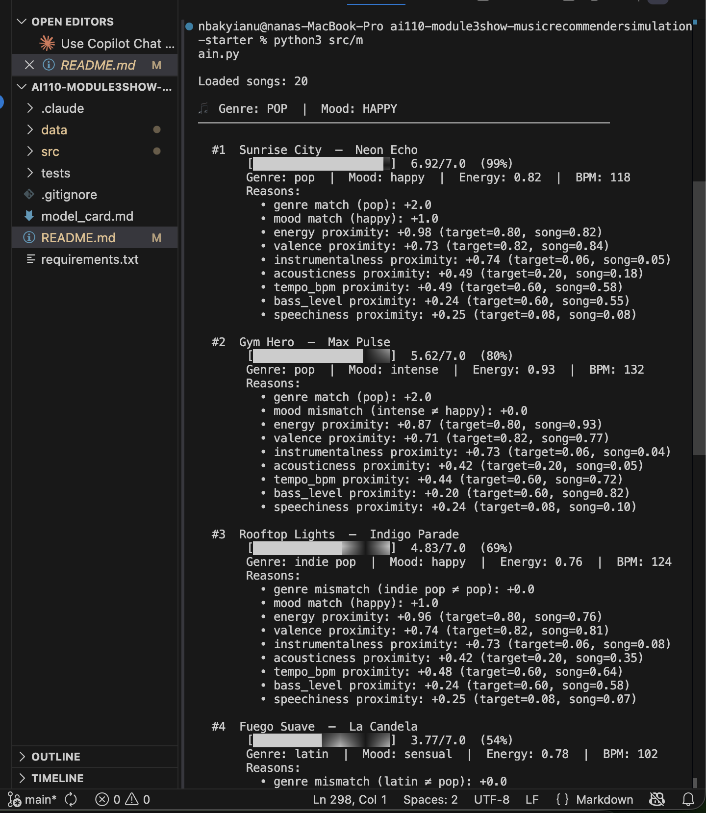

# 🎵 Music Recommender Simulation

## Project Summary

In this project you will build and explain a small music recommender system.

Your goal is to:

- Represent songs and a user "taste profile" as data
- Design a scoring rule that turns that data into recommendations
- Evaluate what your system gets right and wrong
- Reflect on how this mirrors real world AI recommenders

This simulation builds a content-based music recommender that scores songs against a user's taste profile using a weighted formula across genre, mood, energy, and valence. It prioritizes musical "vibe" alignment over popularity, returning a ranked top-k list with a plain-language explanation for each recommendation.

---

## How The System Works

Real-world platforms like Spotify and YouTube predict what you will love next by combining two strategies: collaborative filtering (finding patterns across millions of users with similar taste) and content-based filtering (analyzing the actual attributes of a song — tempo, energy, mood — to find sonic matches). This simulation focuses entirely on the content-based approach, which means it does not need any other user's data. Instead, it compares each song's attributes directly against a single user's stated preferences and scores how closely they align. The system prioritizes **vibe fit over popularity**: a quiet lofi track that perfectly matches your mood and energy target will rank above a viral hit that does not.

The data flow is: **User Preferences → Score every song → Sort → Return top-k results.**

---

### Song Features

Each `Song` object stores 13 attributes from `data/songs.csv`:

| Feature | Type | Role in scoring |
|---|---|---|
| `id` | int | Unique identifier (not scored) |
| `title` | str | Display label (not scored) |
| `artist` | str | Display label (not scored) |
| `genre` | str | Categorical match — +2.0 or +0.0 |
| `mood` | str | Categorical match — +1.0 or +0.0 |
| `energy` | float (0–1) | Proximity score — up to +1.00 |
| `valence` | float (0–1) | Proximity score — up to +0.75 |
| `instrumentalness` | float (0–1) | Proximity score — up to +0.75 |
| `acousticness` | float (0–1) | Proximity score — up to +0.50 |
| `tempo_bpm` | float (60–160) | Proximity score (normalized) — up to +0.50 |
| `bass_level` | float (0–1) | Proximity score — up to +0.25 |
| `speechiness` | float (0–1) | Proximity score — up to +0.25 |
| `danceability` | float (0–1) | Stored but not used in scoring |

---

### User Profile Features

The user profile is a dictionary of target preferences passed into the scoring functions:

| Key | Type | Purpose |
|---|---|---|
| `genre` | str | Target genre for exact match |
| `mood` | str | Target mood for exact match |
| `target_energy` | float (0–1) | Ideal energy level |
| `target_valence` | float (0–1) | Ideal emotional brightness |
| `target_instrumentalness` | float (0–1) | Preference for no vocals |
| `target_acousticness` | float (0–1) | Preference for organic vs. electronic sound |
| `target_tempo_bpm` | int | Ideal tempo in beats per minute |
| `target_bass_level` | float (0–1) | Preference for bass heaviness |
| `target_speechiness` | float (0–1) | Tolerance for rap or spoken word |

---

### Algorithm Recipe (Finalized)

The scoring system awards points out of a **maximum of 7.0** per song. It has two stages:

**Stage 1 — Score every song individually** using `score_song(user_prefs, song)`:

```
CATEGORICAL (binary — all or nothing):
  +2.00  Genre match     song.genre == user.genre
  +1.00  Mood match      song.mood  == user.mood

PROXIMITY (scaled — closer = more points):
  +1.00  Energy           1.00 × (1 − |target − song_value|)
  +0.75  Valence          0.75 × (1 − |target − song_value|)
  +0.75  Instrumentalness 0.75 × (1 − |target − song_value|)
  +0.50  Acousticness     0.50 × (1 − |target − song_value|)
  +0.50  Tempo            0.50 × (1 − |normalized_target − normalized_value|)
  +0.25  Bass level       0.25 × (1 − |target − song_value|)
  +0.25  Speechiness      0.25 × (1 − |target − song_value|)
─────────────────────────────────────────────────────────────
  7.00   MAX POSSIBLE SCORE
```

Tempo is normalized from its raw BPM range (60–160) to a 0–1 scale before scoring so it does not unfairly dominate the result.

**Stage 2 — Rank and return the top-k** using `recommend_songs(user_prefs, songs, k=5)`:

```
1. Run score_song on every song in the catalog
2. Sort all results from highest score to lowest
3. Return the top k songs with their scores and explanations
```

---

### Sample Terminal Output



---

### Potential Biases and Known Limitations

**Genre acts as a hard ceiling.**
Because genre carries +2.0 out of 7.0 points (28% of the total), a song that misses on genre can score at most 5.0 — and will almost never appear in the top 5 even if every other feature is a perfect match. This means a great jazz track could be invisible to a user whose profile says "lofi," even though the vibe is nearly identical. This is the system's biggest known bias.

**Mood is all-or-nothing.**
"Chill" and "focused" are treated as completely different even though they often feel similar to a listener. The binary match gives no partial credit for related moods, which penalizes songs that are close but not exact.

**The catalog is tiny and reflects a narrow taste range.**
With only 20 songs, the system has very little to choose from. Underrepresented genres (e.g., classical, country) have only one song each, so a user who prefers those genres will always get the same first result regardless of their other preferences.

**Numeric targets are symmetric — being too low is punished equally to being too high.**
A user who wants energy=0.40 loses the same points from a song with energy=0.20 (too quiet) as from one with energy=0.60 (too lively). In reality, many listeners have an asymmetric tolerance — they might forgive slightly too mellow but strongly dislike slightly too intense.

**No listening context.**
The system does not know the time of day, what was just played, or whether the user is in a different mood than usual. Real platforms use session-level signals to adjust in real time; this system always applies the same static profile.

---

## Getting Started

### Setup

1. Create a virtual environment (optional but recommended):

   ```bash
   python -m venv .venv
   source .venv/bin/activate      # Mac or Linux
   .venv\Scripts\activate         # Windows

2. Install dependencies

```bash
pip install -r requirements.txt
```

3. Run the app:

```bash
python -m src.main
```

### Running Tests

Run the starter tests with:

```bash
pytest
```

You can add more tests in `tests/test_recommender.py`.

---

## Experiments You Tried

Use this section to document the experiments you ran. For example:

- What happened when you changed the weight on genre from 2.0 to 0.5
- What happened when you added tempo or valence to the score
- How did your system behave for different types of users

---

## Limitations and Risks

Summarize some limitations of your recommender.

Examples:

- It only works on a tiny catalog
- It does not understand lyrics or language
- It might over favor one genre or mood

You will go deeper on this in your model card.

---

## Reflection

Read and complete `model_card.md`:

[**Model Card**](model_card.md)

Write 1 to 2 paragraphs here about what you learned:

- about how recommenders turn data into predictions
- about where bias or unfairness could show up in systems like this


---

## 7. `model_card_template.md`

Combines reflection and model card framing from the Module 3 guidance. :contentReference[oaicite:2]{index=2}  

```markdown
# 🎧 Model Card - Music Recommender Simulation

## 1. Model Name

Give your recommender a name, for example:

> VibeFinder 1.0

---

## 2. Intended Use

- What is this system trying to do
- Who is it for

Example:

> This model suggests 3 to 5 songs from a small catalog based on a user's preferred genre, mood, and energy level. It is for classroom exploration only, not for real users.

---

## 3. How It Works (Short Explanation)

Describe your scoring logic in plain language.

- What features of each song does it consider
- What information about the user does it use
- How does it turn those into a number

Try to avoid code in this section, treat it like an explanation to a non programmer.

---

## 4. Data

Describe your dataset.

- How many songs are in `data/songs.csv`
- Did you add or remove any songs
- What kinds of genres or moods are represented
- Whose taste does this data mostly reflect

---

## 5. Strengths

Where does your recommender work well

You can think about:
- Situations where the top results "felt right"
- Particular user profiles it served well
- Simplicity or transparency benefits

---

## 6. Limitations and Bias

Where does your recommender struggle

Some prompts:
- Does it ignore some genres or moods
- Does it treat all users as if they have the same taste shape
- Is it biased toward high energy or one genre by default
- How could this be unfair if used in a real product

---

## 7. Evaluation

How did you check your system

Examples:
- You tried multiple user profiles and wrote down whether the results matched your expectations
- You compared your simulation to what a real app like Spotify or YouTube tends to recommend
- You wrote tests for your scoring logic

You do not need a numeric metric, but if you used one, explain what it measures.

---

## 8. Future Work

If you had more time, how would you improve this recommender

Examples:

- Add support for multiple users and "group vibe" recommendations
- Balance diversity of songs instead of always picking the closest match
- Use more features, like tempo ranges or lyric themes

---

## 9. Personal Reflection

A few sentences about what you learned:

- What surprised you about how your system behaved
- How did building this change how you think about real music recommenders
- Where do you think human judgment still matters, even if the model seems "smart"

