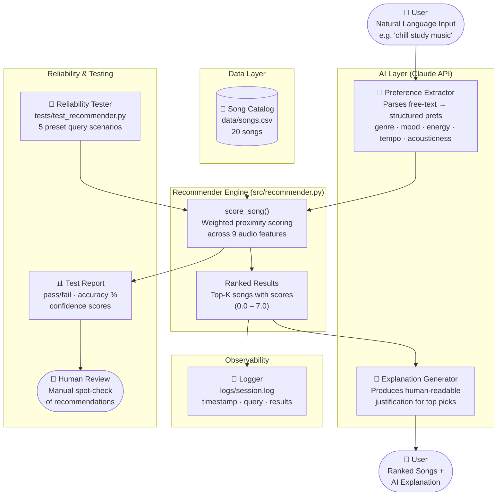

# System Architecture — AI Music Recommender

## Data Flow Diagram



---

## Component Summary

| Component | File | Role |
|---|---|---|
| Preference Extractor | Claude API (ai_interface.py) | Converts natural language → structured prefs dict |
| Recommender Engine | src/recommender.py | Scores every song; returns ranked top-K |
| Song Catalog | data/songs.csv | 20 songs with 9 audio features each |
| Explanation Generator | Claude API (ai_interface.py) | Generates a plain-English justification for picks |
| Logger | logs/session.log | Records every query + result for audit/debugging |
| Reliability Tester | tests/test_recommender.py | 5 preset scenarios; auto-grades expected vs actual |
| Human Review | Manual | Spot-checks AI explanations for accuracy and tone |

---

## Input → Output Example

```
Input:  "I need something calm and instrumental to focus while coding"

          ↓  Claude extracts:
          genre=lofi, mood=focused, energy=0.40,
          instrumentalness=0.80, acousticness=0.70

          ↓  Recommender scores 20 songs

          ↓  Top pick: "Focus Flow" — LoRoom (score: 6.31/7.0)

Output: "Focus Flow by LoRoom is a strong match — lofi genre,
         focused mood, low energy (0.40), and highly instrumental
         (0.80), which suits a distraction-free coding session."
```
